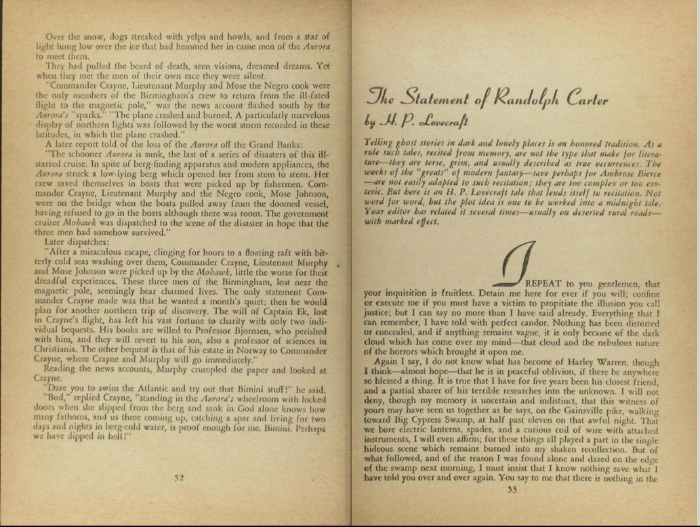

#Textual Encoding Workshop

The goal of this workshop is to introduce students to marking up documents with structured markup languages like [TEI P5](http://www.tei-c.org/Guidelines/P5/) and [JATS](http://jats.nlm.nih.gov/).

##Text Encoding Initiative

Let's consider how to markup H.P. Lovecraft's short story, ["The Statement of Randolph Carter"](https://en.wikisource.org/wiki/Avon_Fantasy_Reader/Issue_10/The_Statement_of_Randolph_Carter). How would you represent this document as [plain text](TEI/Randolph_Carter.txt), [HTML](TEI/Randolph_Carter.html), [ePub](TEI/Randolph_Carter.epub)? Here's how it might be rendered in very simple [TEI](TEI/randolph-carter.xml). How could we improve its representation?

[](https://archive.org/stream/AvonFantasyReader10#page/n53/mode/2up)

##Journal Article Tagging Suite

The Journal Article Tagging Suite or [JATS](http://jats.nlm.nih.gov/) is a set of three schemas for marking up journal articles and scholarly books. Here is a [sample article](JATS/journal.pbio.1002402.XML) marked up with JATS. 

Interestingly, all the articles in [PLOS](https://www.plos.org/) can be downloaded in JATS format. Here's [a tar file with a whole bunch of PLOS articles](JATS/pbio-xml.tgz). The [Open Library of the Humanities](https://olh.openlibhums.org/) also provides articles in JATS format for download.

You can also download open access papers in [PubMed Central](http://www.ncbi.nlm.nih.gov/pmc/) in the JATS format. To do so, you need to use the PubMed API. If we wanted to access this paper on [A Blood Pressure Monitoring Method for Stroke Management](http://www.ncbi.nlm.nih.gov/pmc/articles/PMC4150505/), for instance, we'd call the API (http://www.ncbi.nlm.nih.gov/pmc/utils/oa/oa.fcgi?id=) with it's PubMed Identifier (PMC4150505): [http://www.ncbi.nlm.nih.gov/pmc/utils/oa/oa.fcgi?id=PMC4150505](http://www.ncbi.nlm.nih.gov/pmc/utils/oa/oa.fcgi?id=PMC4150505). The result provides links to two versions of the paper: a PDF and a JATS version.

```xml
<OA>
  <responseDate>2016-03-17 23:54:27</responseDate>
  <request id="PMC4150505">http://www.ncbi.nlm.nih.gov/pmc/utils/oa/oa.fcgi?id=PMC4150505</request>
  <records returned-count="2" total-count="2">
    <record id="PMC4150505" citation="Biomed Res Int. 2014 Aug 17; 2014:571623">
      <link format="tgz" updated="2014-09-10 19:11:13 href="ftp://ftp.ncbi.nlm.nih.gov/pub/pmc/4e/d1/Biomed_Res_Int_2014_Aug_17_2014_571623.tar.gz"/>
      <link format="pdf" updated="2014-09-01 13:29:27" href="ftp://ftp.ncbi.nlm.nih.gov/pub/pmc/4e/d1/BMRI2014-571623.PMC4150505.pdf"/>
    </record>
  </records>
</OA>
```

We can then query the FTP site for a tarball containing the JATS article, the accompanying figures, the license, and a PDF version.
